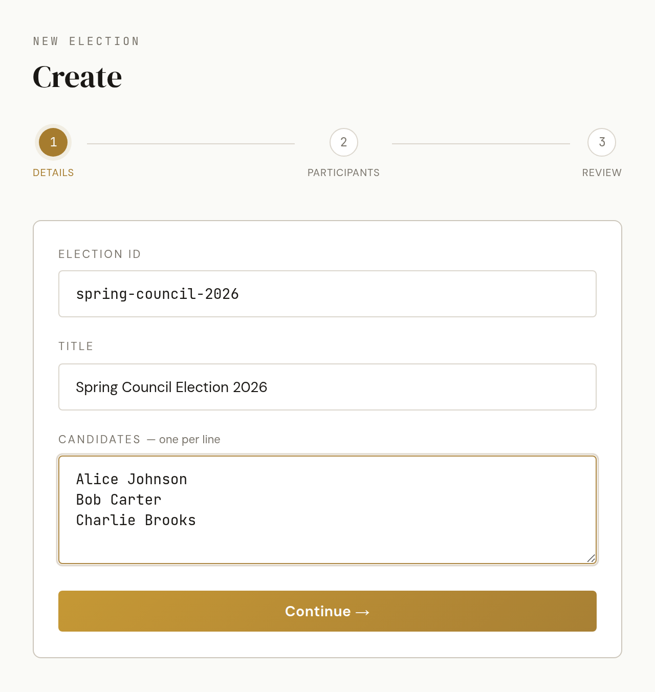
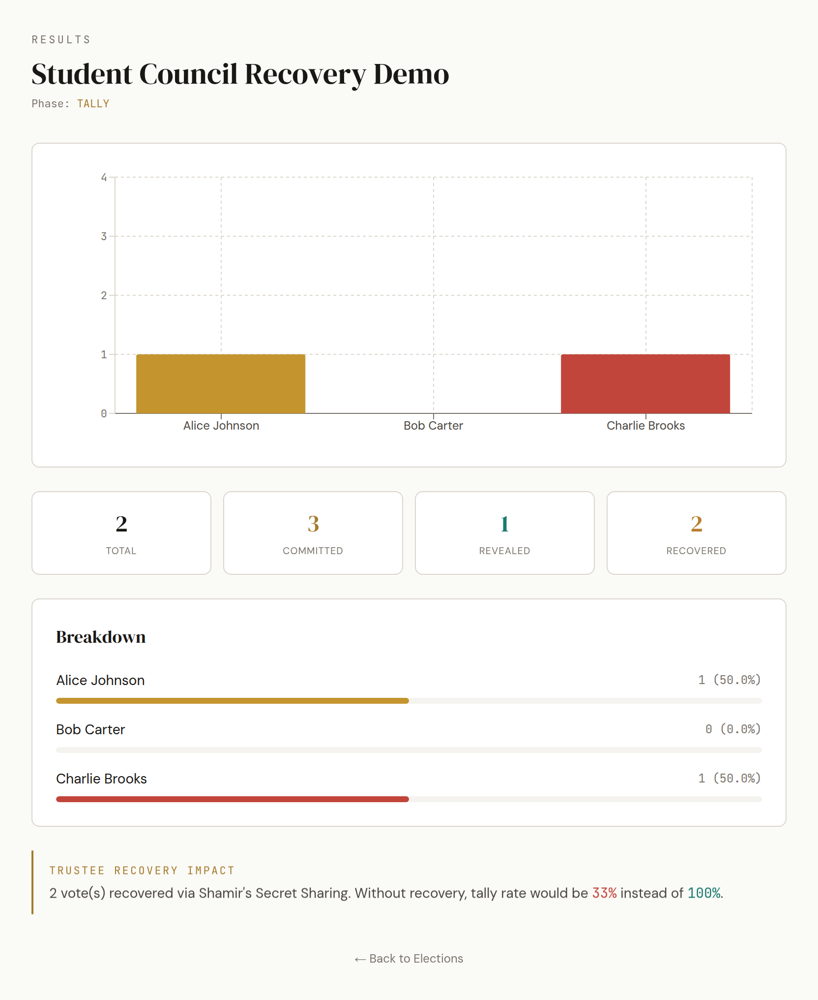
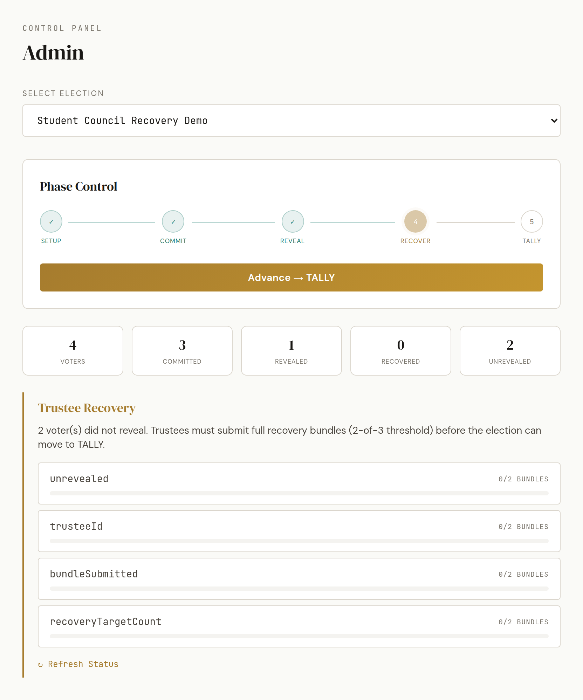
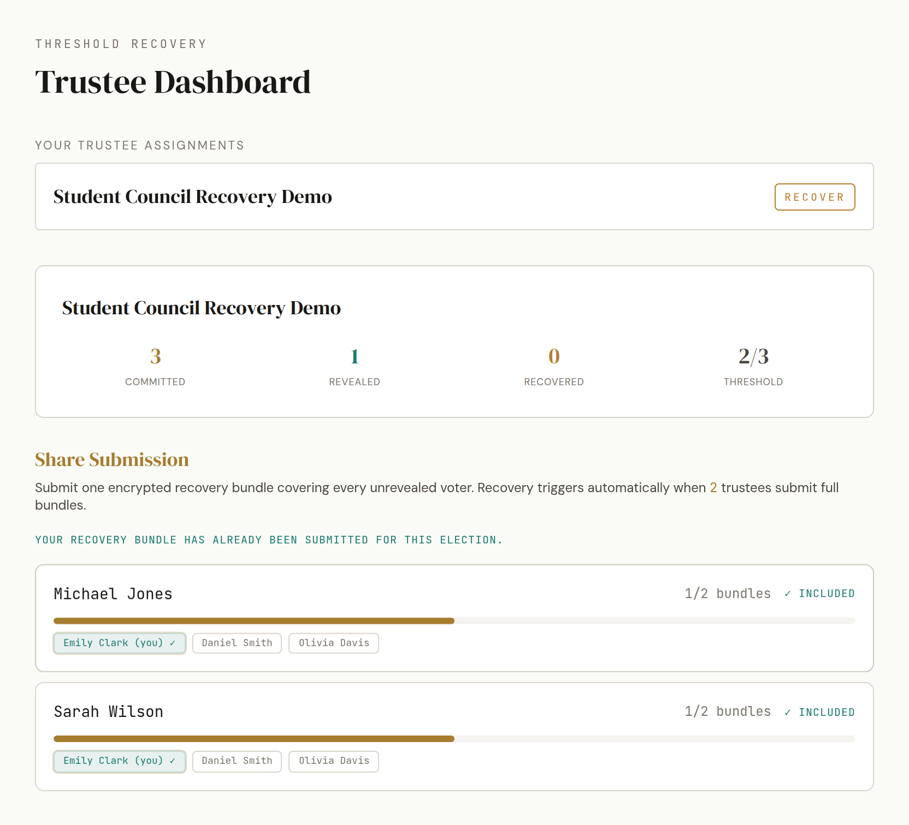

# VivaVote

**Storage-efficient and dropout-resilient electronic voting on Hyperledger Fabric.**

VivaVote addresses two practical weaknesses of naïve commit-reveal voting on a permissioned blockchain: eligibility state that grows linearly with the voter roster, and committed ballots permanently lost when voters fail to return for the reveal phase.

Eligibility is anchored by a single Merkle root stored on-chain at setup time — a constant-size record regardless of how many voters are registered. Reveal dropout is handled by a trustee committee: each voter's reveal secret is split into Feldman-verifiable Shamir shares and encrypted for designated trustees. If a voter commits but never reveals, a threshold quorum of trustees can collectively reconstruct and count the ballot, with every submitted share independently verified before reconstruction.

The system ships with a full React frontend, an Express API server, and two chaincodes — the primary VivaVote protocol and a naïve per-voter-registration baseline for direct comparison. A mock mode lets you run the full protocol locally without Docker in seconds.

---

<p align="center">
  
  
</p>
<p align="center">
  
  
</p>
<p align="center">
  
</p>

---

## Key Features

- **Merkle-root eligibility** — only a single 32-byte root is stored on-chain at setup time. Voter count has no effect on ledger setup state. Eligibility is verified at commit time via an O(log n) Merkle proof checked by the chaincode.
- **Commit-reveal voting** — all commit-side cryptography (commitment generation, share splitting, share encryption) runs in the voter's browser. The application server and ordinary ledger observers never see a plaintext ballot.
- **Feldman-verifiable threshold recovery** — each voter's reveal secret is split using Shamir's Secret Sharing with Feldman polynomial commitments. If a voter commits but never reveals, any T-of-N trustees can submit decrypted share bundles; the chaincode checks each share against its stored digest and Feldman commitment before Lagrange-interpolating the secret and verifying it against the original commitment. Every committed ballot is counted, whether via direct reveal or trustee reconstruction, provided a threshold quorum of trustees is available.
- **Voters and trustees are disjoint by construction** — no participant can both cast a ballot and participate in ballot recovery. The election creation UI enforces this constraint.
- **Dual-mode operation** — mock mode simulates the full protocol in-memory (no Docker); Fabric mode runs against a real local Hyperledger Fabric 2.5 network. Both expose the exact same API and UI.
- **Admin and trustee dashboards** — full visibility into election phase transitions, recovery bundle submission progress, and a live transaction feed.
- **Baseline chaincode** — a naïve per-voter-registration implementation included for direct protocol comparison.

## Architecture

```
┌─────────────────────────────────────────┐
│         React + Vite  (port 3000)       │
└────────────────┬────────────────────────┘
                 │  REST + WebSocket
┌────────────────▼────────────────────────┐
│       Express API Server  (port 4000)   │
│                                         │
│  ┌──────────────┐  ┌──────────────────┐ │
│  │  MockStore   │  │   FabricStore    │ │
│  │ (in-memory)  │  │  (gRPC gateway)  │ │
│  └──────────────┘  └────────┬─────────┘ │
└───────────────────────────┬─┴───────────┘
                             │
          ┌──────────────────▼──────────────────┐
          │     Hyperledger Fabric Test Network  │
          │   vivavote chaincode (Merkle+Shamir) │
          │   baseline chaincode (naïve)         │
          └─────────────────────────────────────┘
```

Three roles participate in the system. The **Election Authority** creates elections, defines the voter roster and trustee committee, and advances election phases. **Voters** commit and reveal ballots; eligibility is proved via Merkle proofs rather than on-chain registration records. **Trustees** hold encrypted Shamir shares and submit recovery bundles during the RECOVER phase if voters drop out.

## Evaluation Highlights

The following results are from a live two-organization Hyperledger Fabric 2.5 deployment, with a naïve per-voter-registration baseline as the comparison point. Each data point is the average of five trials.

| Metric                                 | VivaVote         | Baseline                |
| -------------------------------------- | ---------------- | ----------------------- |
| Setup latency (10–100 voters)         | 2301–2374 ms    | 4894–4978 ms           |
| On-ledger setup keys (100 voters)      | **2**      | 102                     |
| Sequential commit throughput           | 0.404–0.405 TPS | 0.404–0.407 TPS        |
| Tally completeness (all dropout rates) | **100%**   | Degrades proportionally |

Setup latency is reduced by roughly half because the Merkle-root design submits one constant-size record instead of one ledger key per voter. Commit throughput is statistically indistinguishable from the baseline — Merkle-proof verification averages 5–6 ms on-chain, negligible against the multi-second Fabric transaction pipeline. Tally completeness holds at 100% under all tested dropout rates (100 %, 75 %, and 50 % reveal).

Eight targeted invalid-operation tests — out-of-phase commits, ineligible voters, duplicate ballots, wrong nonces, unauthorized recovery, tampered shares, incomplete bundles, and duplicate bundles — were all correctly rejected by the chaincode.

## Stack

| Layer    | Technologies                                                                       |
| -------- | ---------------------------------------------------------------------------------- |
| Frontend | React 18, Vite, Tailwind CSS, Recharts, Web Crypto API                             |
| API      | Node.js, Express, WebSocket (ws), JWT, merkletreejs                                |
| Ledger   | Hyperledger Fabric 2.5, Go chaincode                                               |
| Crypto   | Shamir's Secret Sharing + Feldman VSS over GF(256), RSA-OAEP-2048-SHA-256, SHA-256 |

## Repository Structure

```
VivaVote/
├── api-server/            # Express API — routes, mock store, Fabric gateway
├── chaincode/
│   ├── vivavote/          # VivaVote protocol chaincode (Merkle + Shamir SSS)
│   └── baseline/          # Naïve baseline chaincode for comparison
├── docs/images/           # Screenshots used in this README
├── frontend/              # React application
├── install-fabric.sh      # Fabric binaries and samples bootstrap
├── start.sh               # One-command startup (mock or Fabric)
└── stop.sh                # One-command shutdown
```

## Prerequisites

| Tool           | Version | Required for     |
| -------------- | ------- | ---------------- |
| Node.js        | 18+     | Always           |
| npm            | 9+      | Always           |
| Docker         | 20+     | Fabric mode only |
| Docker Compose | v2+     | Fabric mode only |

Linux and macOS are fully supported. On Windows, use WSL2.

---

## Quick Start

```bash
git clone https://github.com/SadatHossain01/VivaVote.git
cd VivaVote
./start.sh
```

`start.sh` installs all dependencies, starts the API server, and launches the frontend dev server. No Docker required.

| Service   | URL                              |
| --------- | -------------------------------- |
| Frontend  | http://localhost:3000            |
| API       | http://localhost:4000/api        |
| WebSocket | ws://localhost:4000/ws           |
| Health    | http://localhost:4000/api/health |

**Demo accounts**

| Role         | Username                  | Password  |
| ------------ | ------------------------- | --------- |
| Admin        | `admin`                 | `admin` |
| Voter (×10) | `voter_1`–`voter_10` | `123`   |

To stop:

```bash
./stop.sh
```

---

## Running with Hyperledger Fabric

```bash
./start.sh --fabric
```

On first run, the script will automatically download the Fabric binaries, Docker images, and `fabric-samples`, start the test network, create a channel, and deploy both chaincodes. This takes a few minutes on the first run; subsequent runs are fast.

To stop and tear down the network:

```bash
./stop.sh --fabric
```

---

## Walkthrough

The following steps demonstrate the full VivaVote protocol. Mock mode is recommended unless you specifically need a real Fabric ledger.

1. **Register users** — demo voter and trustee accounts are pre-seeded. Additional users can self-register.
2. **Trustees must log in at least once** before election creation so the browser can generate and register their RSA recovery public keys.
3. **Admin creates an election** — set the title, candidates, voter list, trustee list, and a recovery threshold (e.g. `2-of-3`).
4. **Advance to COMMIT** — from the admin dashboard, move the election to the commit phase.
5. **Voters commit** — each voter selects a candidate in the voting booth. A commit hash and encrypted trustee shares are generated entirely in the browser.
6. **Advance to REVEAL** — voters return to the voting booth and reveal their ballot using the saved receipt.
7. **Simulate dropout** — skip the reveal step for one or more voters to trigger recovery.
8. **Advance to RECOVER** — trustees open their dashboard and submit decrypted share bundles for the unrevealed voters.
9. **Advance to TALLY** — once all unrevealed votes are recovered, the admin finalises the tally. The results page shows the recovery impact alongside the final count.

---

## Manual Development Setup

Run services individually if you prefer more control:

```bash
# Terminal 1 — API server
cd api-server && npm ci && npm start

# Terminal 2 — Frontend
cd frontend && npm ci && npm run dev
```

To target a running Fabric network manually:

```bash
cd api-server
USE_FABRIC=true FABRIC_SAMPLES_PATH=../fabric-samples npm start
```

## Configuration

All settings have sensible defaults. Override via environment variables if needed:

| Variable                | Default                    | Description                                  |
| ----------------------- | -------------------------- | -------------------------------------------- |
| `PORT`                | `4000`                   | API server port                              |
| `USE_FABRIC`          | `false`                  | Enable Hyperledger Fabric mode               |
| `FABRIC_SAMPLES_PATH` | `./fabric-samples`       | Path to Fabric samples directory             |
| `CHANNEL_NAME`        | `mychannel`              | Fabric channel name                          |
| `JWT_SECRET`          | *(dev fallback in code)* | JWT signing secret — override in production |

## Notes

- **Mock mode is ephemeral.** All state (elections, users, votes) lives in memory and is reset when the API server restarts.
- **Trustee recovery keys** are generated in the browser and stored in `localStorage`. If browser storage is cleared, the private key is lost and the trustee cannot decrypt their assigned shares.
- **Trustees must log in before being assigned.** The election creation UI will show a warning and disable the trustee button for any user who has not yet registered a recovery key.
- **Ballot confidentiality boundary.** All commit-side cryptography runs in the voter's browser. Neither the API server nor ordinary ledger readers see a plaintext ballot. However, any colluding group of T or more trustees *can* reconstruct individual ballots outside the normal protocol flow. VivaVote is not a coercion-resistant protocol — its confidentiality holds only below the trustee threshold.
- **Recovery requires a quorum.** If fewer than T trustees submit valid bundles during the RECOVER phase, unrevealed ballots cannot be recovered. The prototype does not yet implement penalty mechanisms, backup trustees, or key rotation.
- The authentication layer uses a simple in-memory store suitable for local development and demos. It is not intended for production deployment.

## Troubleshooting

| Symptom                                         | Fix                                                                                   |
| ----------------------------------------------- | ------------------------------------------------------------------------------------- |
| Port 3000 or 4000 already in use                | Run `./stop.sh` then retry                                                          |
| Docker permission denied                        | Add your user to the `docker` group: `sudo usermod -aG docker $USER`              |
| First Fabric start is very slow                 | Expected — Fabric is downloading ~1 GB of images and binaries                        |
| Spaces in the project path break Fabric scripts | The startup script automatically creates a symlink under `/tmp` to work around this |
| Trustee button greyed out in election creation  | That user has not logged in yet; have them log in once to generate their key          |

## License

[LICENSE](LICENSE)
